# ExpressDiff
Differential Analysis Pipeline for RNA-Seq Data

# Setup
## Go to ood.hpc.virginia.edu to start a Desktop interactive job and a JupyterLab job
if prompted, sign in with UVA account
### Find the button to start interactive jobs in the taskbar on top
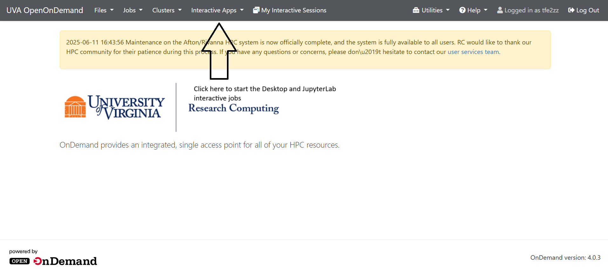
### Choose Desktop or JupyterLab from the dropdown
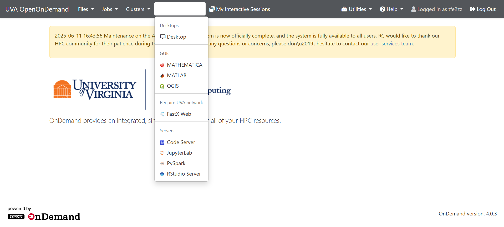
For the JupyterLab job, we recommend allocating around 64GB of memory (but if your files are larger, you may need to add more!)
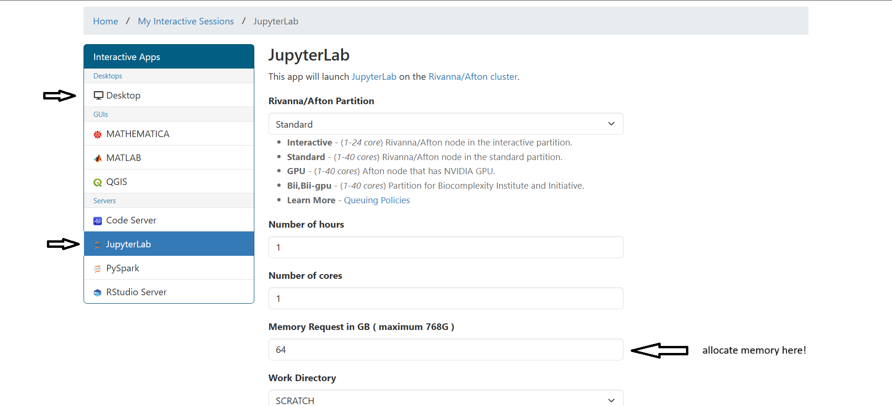
You can also create a new job by selecting from the menu on the left
After creating a job, you should be brought to a page that shows your interactive jobs (this is what it looks like after creating both jobs):
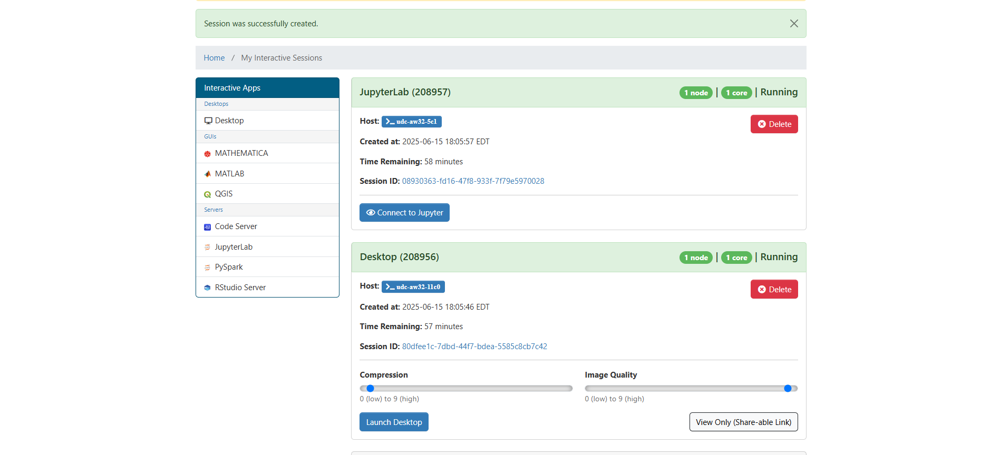
if they say Queued or Starting, you may need to wait for a moment.
### Click the "Connect to Jupyter" and "Launch Desktop" buttons to open the interactive jobs
the JupyterLab tab will open a terminal for you, but it may not be in the right directory. Use this command to see the directory you are in.
```shell
pwd
```
For example, I have an empty directory called Example (can see on sidebar on the left), but the initial terminal is not in that same directory:
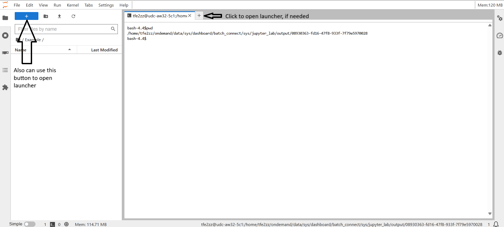
if it's in the wrong directory, can click the + icon to open the launcher, then scroll down and open a new terminal to quickly go to the directory you have open in the sidebar
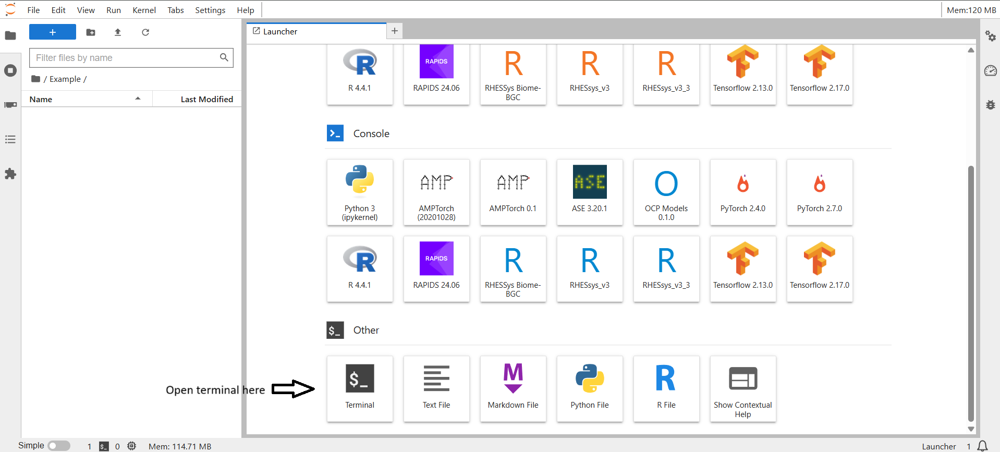
## Clone Git Repository
run this command in the terminal after checking that you are in the right directory
```shell
git clone https://github.com/StevenZev/ExpressDiff.git
```
then run this command to go into the repository you just cloned
```shell
cd ExpressDiff
```
would look something similar to this:
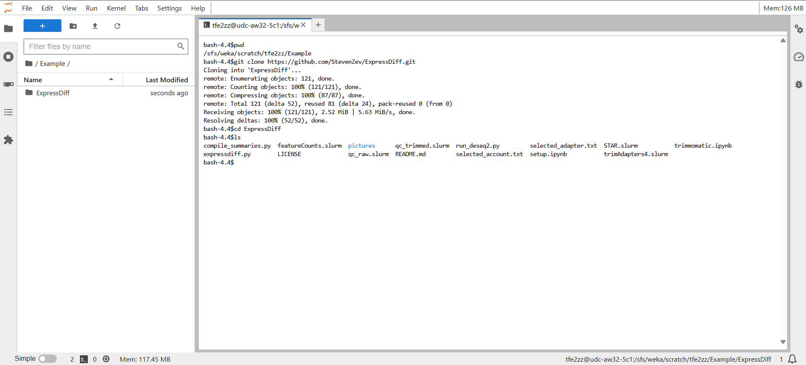
I used this command to check the contents of the current directory:
```shell
ls
```
Then, can click on the ExpressDiff folder on the left to open it in the sidebar
## Open setup.ipynb (from the sidebar on the left)
Hit button to restart kernel and run all cells and make sure to use Python3 kernel
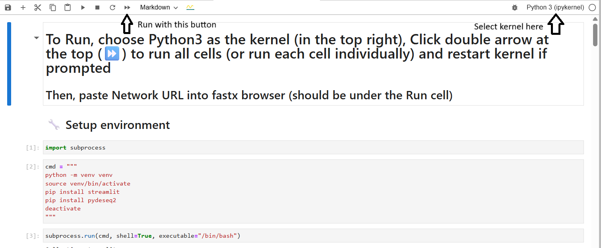
## Scroll to bottom and copy the Network URL
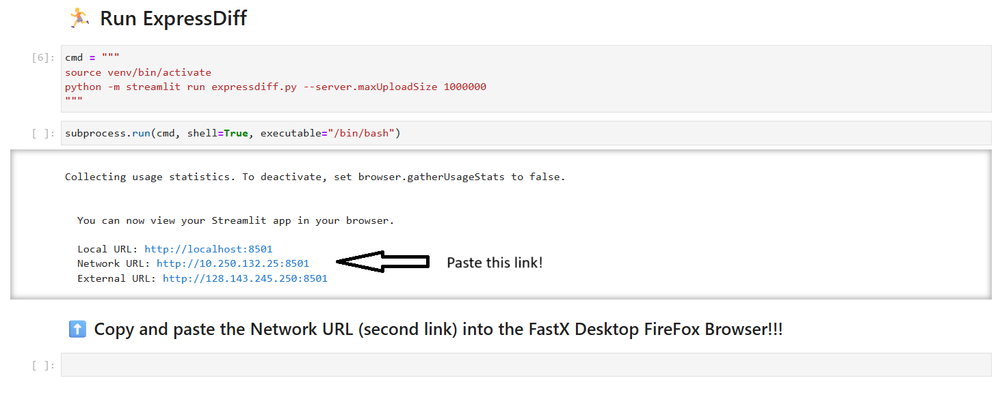
## Go to the Desktop interactive job tab and open a web browser (Firefox is already installed) then paste in the Network URL in a new tab to open app
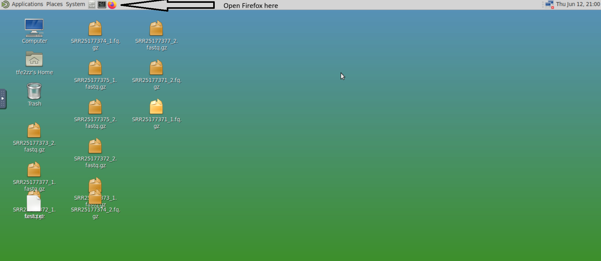

# MEMORY
if you see this, then you may need to allocate more memory:
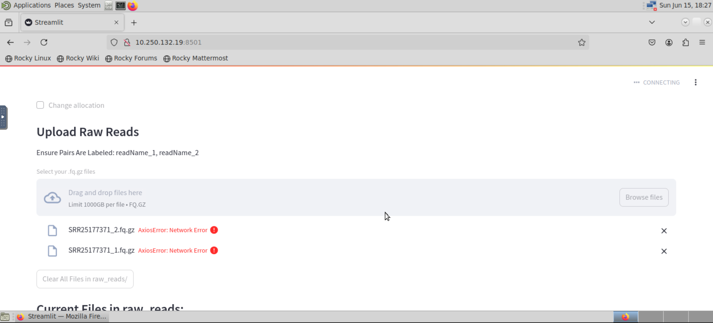
The AxiosError: NetworkError means that the program couldn't connect because the program could have terminated because it didn't have enough memory. The amount of memory you need depends on the files you're using (the file manager should show how large the files are). Also, can drag or control click to select multiple files.

---

# FastAPI Backend (New Architecture)

ExpressDiff now includes a modern FastAPI backend that provides a REST API for pipeline management. This enables future React frontend development and programmatic access.

## Backend Features

- **REST API**: Clean endpoints for creating runs, submitting stages, monitoring progress
- **State Management**: JSON-based persistence of run states and job tracking
- **SLURM Integration**: Reuses existing SLURM scripts with enhanced job monitoring
- **Type Safety**: Pydantic models for request/response validation
- **File Upload**: Support for FASTQ, reference, and metadata file uploads
- **Sample Validation**: Automatic pairing validation for paired-end reads

## Quick Start (FastAPI)

### 1. Install Dependencies
```bash
# Create and activate virtual environment
python -m venv venv_api
source venv_api/bin/activate

# Install backend requirements
pip install -r requirements.txt
```

### 2. Start Development Server
```bash
# Run FastAPI development server
uvicorn backend.api.main:app --reload --host 0.0.0.0 --port 8000
```

### 3. Access API Documentation
- **Interactive docs**: http://localhost:8000/docs
- **OpenAPI schema**: http://localhost:8000/openapi.json

## API Endpoints

### Core Endpoints
- `GET /health` - Health check
- `GET /accounts` - List available SLURM accounts
- `GET /stages` - List pipeline stages

### Run Management
- `POST /runs` - Create new pipeline run
- `GET /runs` - List all runs
- `GET /runs/{run_id}` - Get run details
- `DELETE /runs/{run_id}` - Delete run

### File Operations
- `POST /runs/{run_id}/upload` - Upload files (FASTQ/reference/metadata)
- `GET /runs/{run_id}/samples` - Validate sample pairing
- `GET /runs/{run_id}/results/{type}` - Download results

### Stage Execution
- `POST /runs/{run_id}/stages/{stage}` - Submit pipeline stage
- `GET /runs/{run_id}/stages/{stage}/status` - Check stage status

## Open OnDemand Deployment

### 1. Create OOD Interactive App

Create a custom app directory in your OOD apps folder:
```
/path/to/ood/apps/expressdiff_api/
├── manifest.yml
├── form.yml.erb  
├── submit.yml.erb
└── template/
    └── script.sh.erb
```

### 2. App Configuration Files

**manifest.yml**:
```yaml
name: ExpressDiff API
category: Bioinformatics
subcategory: RNA-Seq
role: batch_connect
description: FastAPI + React interface for RNA-Seq differential pipeline
```

**form.yml.erb**:
```yaml
cluster: "rivanna"
attributes:
  bc_account:
    label: "SLURM Account"
  bc_num_hours:
    label: "Hours"
    value: 4
  bc_num_slots: 
    label: "CPUs"
    value: 4
  memory:
    label: "Memory (GB)" 
    value: 16
form:
  - bc_account
  - bc_num_hours
  - bc_num_slots
  - memory
```

**submit.yml.erb**:
```yaml
batch_connect:
  template: "basic"
script:
  native:
    - "--account=<%= bc_account %>"
    - "--time=<%= bc_num_hours.to_i %>:00:00"
    - "--cpus-per-task=<%= bc_num_slots %>"
    - "--mem=<%= memory.to_i %>G"
```

**template/script.sh.erb**:
```bash
#!/bin/bash

# Load modules
module load python/3.11

# Setup environment
cd "${PWD}"
if [ ! -d venv_api ]; then
    python -m venv venv_api
    source venv_api/bin/activate
    pip install --no-cache-dir -r requirements.txt
else
    source venv_api/bin/activate
fi

# Start FastAPI server
export PORT=${PORT:-8080}
uvicorn backend.api.main:app --host 0.0.0.0 --port ${PORT}
```

### 3. Usage in OOD
1. Submit the interactive app job
2. Connect to the session when it starts
3. Access the API at the provided URL
4. Use the interactive docs at `/docs` endpoint

## Development Notes

### Architecture
- **backend/core/**: Core modules (SLURM integration, configuration)
- **backend/api/**: FastAPI application and routes
- **backend/models.py**: Pydantic models for type validation
- **runs/**: Per-run data directories (gitignored)

### State Management
Each run creates a directory structure:
```
runs/{run_id}/
├── state.json          # Run metadata and stage status
├── raw/                # Uploaded FASTQ files
├── reference/          # Genome FASTA and GTF
├── metadata/           # Sample metadata CSV/TSV
├── qc_raw/            # Raw QC outputs
├── trimmed/           # Trimmed reads
├── qc_trimmed/        # Post-trim QC
├── star/              # Alignment outputs
├── featurecounts/     # Gene quantification
├── counts/            # Count matrix
├── de/                # Differential expression results
└── summaries/         # Pipeline summaries
```

### Future Frontend Integration
The API is designed to support a React frontend with:
- File upload with progress tracking
- Real-time pipeline status monitoring
- Interactive result visualization
- Workflow management interface

For questions or issues with the new API backend, check the logs or refer to the interactive API documentation.
